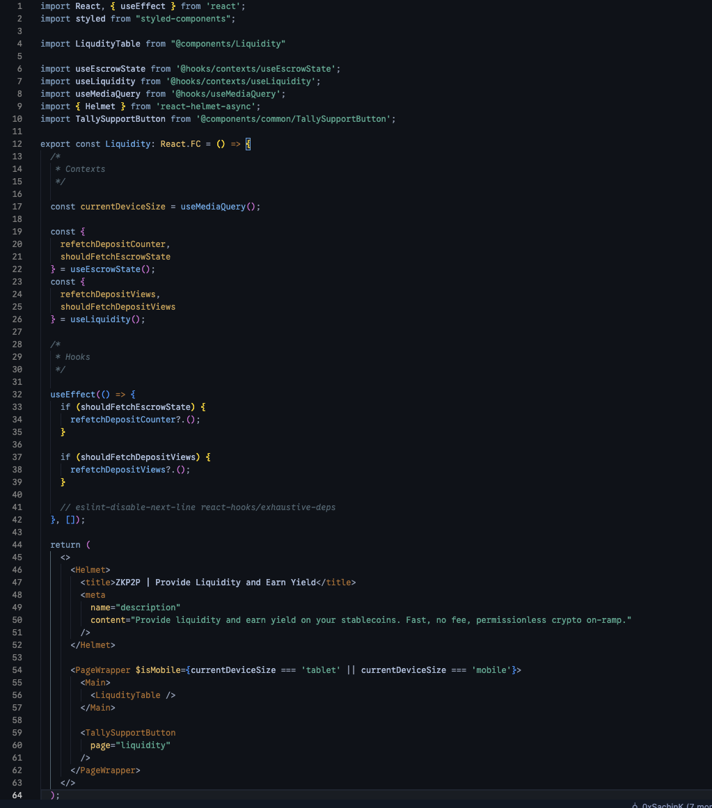

# The Flying Dutchman - Terminal & Editor Theme Collection

A nautical-inspired dark theme collection for terminals and code editors, inspired by the legendary ghost ship and Davy Jones himself. This theme captures the mysterious atmosphere of the deep ocean, with colors reminiscent of nautical charts, aged brass instruments, and the haunting beauty of a ship sailing through eternal fog.

## Available For

- **[VS Code](./themes/)** - Complete syntax highlighting theme
- **[Warp Terminal](./warp/)** - Modern Rust-based terminal theme
- **[iTerm2](./iterm/)** - macOS terminal theme
- **[Windows Terminal](./windows-terminal/)** - Windows modern terminal theme
- **[Vim/Neovim](./vim/)** - Terminal-based editor theme
- **[Sublime Text](./sublime-text/)** - Cross-platform editor theme

## Theme Philosophy

The Flying Dutchman theme draws inspiration from:
- **Deep Ocean Blues**: The primary background colors echo the depths where the Dutchman sails
- **Aged Brass & Gold**: Syntax highlighting uses warm brass tones like those found on ship instruments
- **Sea Foam & Mist**: Variable and function colors mirror the ethereal sea spray
- **Weathered Wood & Iron**: UI elements feature muted tones of a ship worn by centuries at sea
- **Bioluminescent Accents**: Special highlights glow like creatures of the deep

## Color Palette

- **Background**: Deep ocean black (#0d1117) with darker abyss tones (#0b1929)
- **Foreground**: Misty sea spray (#a8c3d8) and aged parchment (#8b9dc3)
- **Keywords**: Storm blue (#7fb3d5) - the color of approaching tempests
- **Strings**: Seaweed green (#48bb78) - life clinging to the hull
- **Functions**: Caribbean blue (#5dade2) - tropical waters the ship once sailed
- **Constants**: Aged brass (#d4af37) - the gleam of old nautical instruments
- **Properties**: Turquoise (#4dc1b5) - shallow reef waters
- **Errors**: Blood red (#e53e3e) - danger on the high seas
- **Comments**: Fog grey (#4a5568) - whispers in the mist

## Installation

### VS Code
1. Open **Extensions** sidebar panel in VS Code: `View → Extensions`
2. Search for `The Flying Dutchman`
3. Click **Install**
4. Click **Reload** to reload VS Code
5. Code > Preferences > Color Theme > **The Flying Dutchman**

### Warp Terminal
1. Copy the theme file to Warp's themes directory:
   ```bash
   mkdir -p ~/.warp/themes
   cp warp/the-flying-dutchman.yaml ~/.warp/themes/
   ```
2. Open Warp Terminal settings (`Cmd+,` on macOS)
3. Navigate to **Appearance** → **Themes**
4. Select "The Flying Dutchman" from the theme list

### Other Terminals
Each terminal has its own installation instructions - see the README in each subdirectory for specific setup steps.

## Manual Installation

1. Clone this repository or download the ZIP
2. Follow the specific installation instructions for your terminal/editor:
   - **VS Code**: Copy to `~/.vscode/extensions/` or `%USERPROFILE%\.vscode\extensions\`
   - **Warp**: Copy YAML to `~/.warp/themes/`
   - **iTerm2**: Import the `.itermcolors` file
   - **Windows Terminal**: Add JSON to settings
   - **Vim**: Copy to `~/.vim/colors/`

## Screenshots

*Coming soon - see your code through the eyes of a ghost ship sailor*

## Recommended Settings

For the best experience sailing with The Flying Dutchman, consider these settings:

```json
{
    "editor.fontFamily": "'Fira Code', 'Cascadia Code', Consolas, monospace",
    "editor.fontLigatures": true,
    "editor.fontSize": 14,
    "editor.lineHeight": 1.6,
    "editor.renderWhitespace": "selection",
    "workbench.iconTheme": "material-icon-theme"
}
```

## Screenshots

### React/TypeScript in Action


*The Flying Dutchman theme showcasing its nautical color palette with React components, TypeScript interfaces, and JSX syntax. Notice the deep ocean background, aged brass constants, sea foam variables, and Caribbean blue functions.*

## What's New

### Recent Updates
- ✨ **Enhanced VSCode Theme**: Added modern features (Command Center, Sticky Scroll, Inline Chat)
- 🔧 **Expanded Semantic Tokens**: Better TypeScript/JavaScript support with decorators, enums, interfaces
- 🎨 **Improved Language Support**: Enhanced Sublime Text theme with comprehensive JavaScript, TypeScript, CSS, Python, JSON, and Markdown support
- 🐛 **Color Consistency**: Fixed discrepancies between iTerm and Windows Terminal themes
- 📚 **Better Documentation**: Complete AI development context and improved installation guides

## Feedback

Encountered a bug or have suggestions? Open an issue on [GitHub](https://github.com/ADWilkinson/the-flying-dutchman-theme/issues).

## License

MIT License - see LICENSE file for details.

---

*"Part of the ship, part of the crew"* - May your code sail smooth waters!